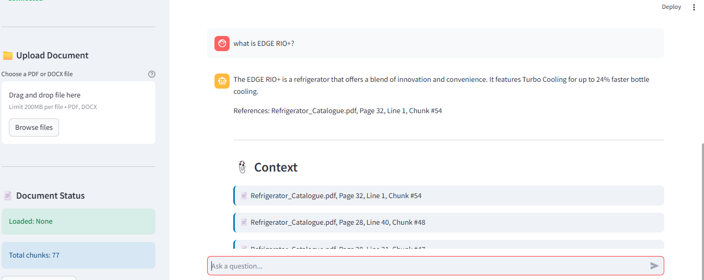
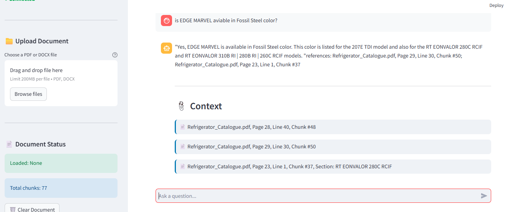
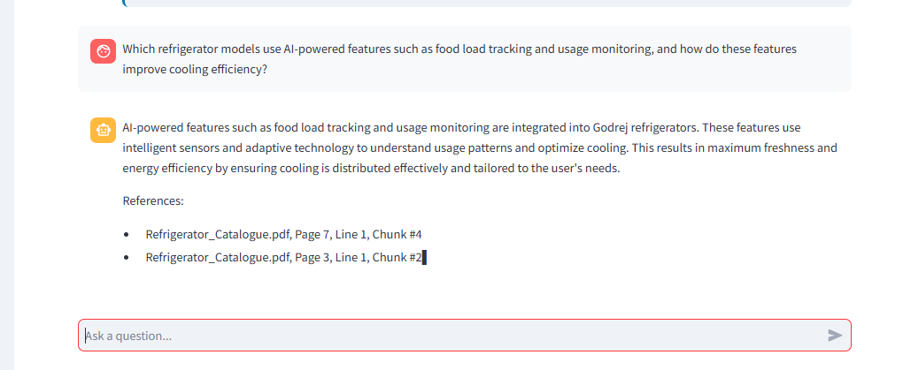
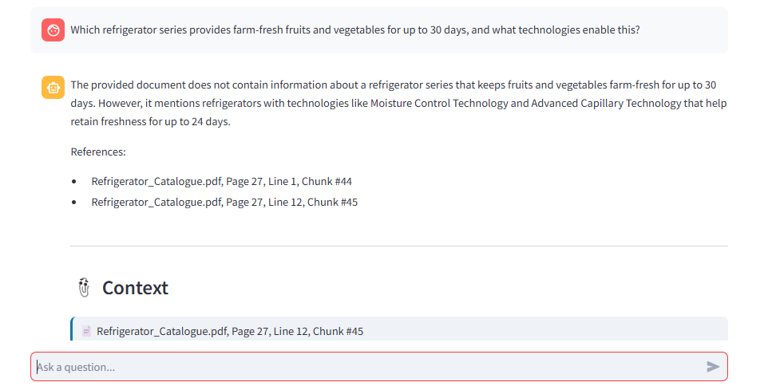

# RAG Pipeline with Hybrid Search - Separate Services Architecture

A Retrieval Augmented Generation (RAG) pipeline featuring hybrid search (BM25 + semantic), intelligent tool-based retrieval, LangGraph orchestration, and Gemini LLM / Azure OpenAI.

# Project Setup and Run Guide

## Prerequisites
- pip
- uv
- Streamlit (installed via requirements.txt)
- Azure OpenAI credentials
- or Google Gemini key
- Python 3.12.12

---

## Setup Steps

### 1. Clone the Repository
git clone https://github.com/SIDDHARTH000001/hybrid-rag.git

cd hybrid-rag

### 2. Create a Virtual Environment using uv
uv venv --python=3.12.12

### 3. Activate the Virtual Environment

Linux / macOS:
source .venv/bin/activate

Windows:
.venv\\Scripts\\activate

### 4. Install Dependencies
uv pip install -r requirements.txt --link-mode=copy

### 5. Configure the Project
- update config.yaml
- Add LLM model name, API keys, and required paths
    Options:
    - gcp
    - azure

- Vector store and upload directories are auto-created on run

---

## Running the Project

### 1. Start the Backend Service
python main.py

### 2. Start the Frontend (New Terminal, Same Venv)
streamlit run frontend_app.py

---

### 3. upload the documents

#### 4. click on Process Documents

### 5. Ask questions

### Examples queries

  - Which refrigerator series provides farm-fresh fruits and vegetables for up to 30 days, and what technologies enable this?
  - What is Nano Shield Technology, and what percentage of food surface disinfection does it provide in Godrej refrigerators? 
  - tell me about EON Velvet?
  - Which refrigerator models use AI-powered features such as food load tracking and usage monitoring, and how do these features improve cooling efficiency?
  - Which single-door refrigerator series offers Turbo Cooling Technology, and what is its maximum farm-freshness duration?
  - What intelligent modes are available in the EON Velvet Side-by-Side refrigerator, and what purpose does each mode serve? 
  - can you tell me about RD ERIOPLS 205C THF?
  - what is EDGE RIO+?
  - is EDGE MARVEL aviable in Fossil Steel color?

---
### Sample Output

---

## Architecture Overview

### Backend (Python)
- Runs the RAG pipeline, hybrid search, document processing, and LLM agent
- Uses a document-only knowledge base with tool-based retrieval
- Returns answers strictly grounded in retrieved document content

### Frontend (Streamlit)
- UI for uploading documents and asking questions
- Displays responses along with document references

---

## Key Design Decisions and Trade-offs
- Strict document-only answering to prevent hallucinations
- Tool-based retrieval ensures traceable and explainable answers
- Backend and frontend are separated for scalability and clarity
- LLM provider is configurable (Gemini / Azure) without code changes
- Fixed fallback response when information is not found in the document

---

## Notes
- Backend must be running before starting the frontend
- Always activate the virtual environment before running commands
- Stop services using CTRL+C

## future enhancemnet 
- multiple queries can b